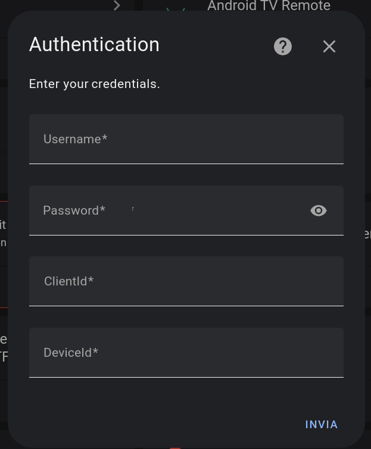
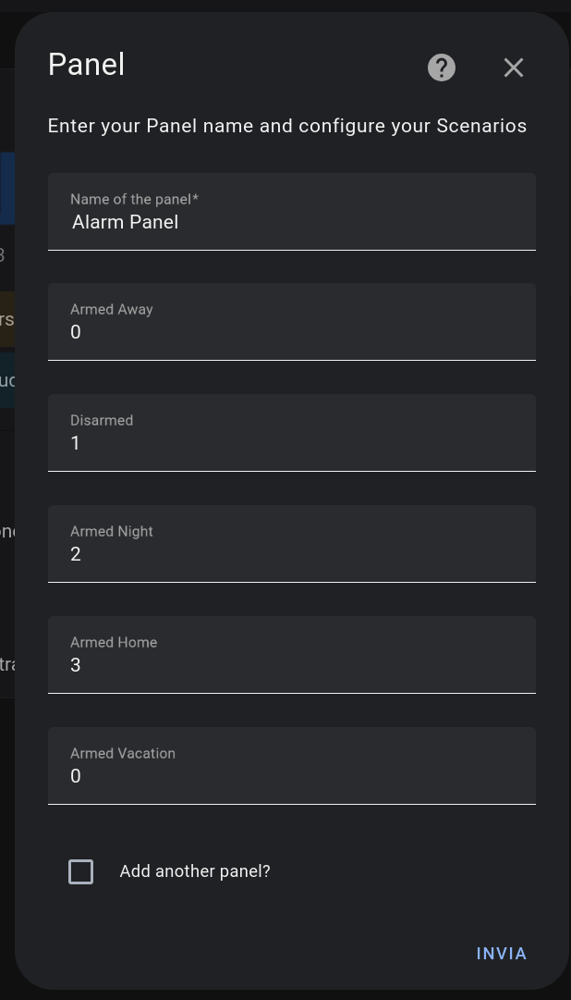

# 🍄 Minim Alarm

[![hacs][hacs-badge]][hacs-url]
[![release][release-badge]][release-url]
![downloads][downloads-badge]

<a href="https://www.buymeacoffee.com/nidble" target="_blank">
  
</a>

## What is Minim Alarm ?

Minim Alarm is a custom component to connect your Minim Alarm with [Home Assistant][home-assistant].

Minim Alarm target is to provide you with all the sensors and the Alarm control panel of [Home Assistant][home-assistant] needed to manager your system.

### Features

- List all the Binary Sensors expsosed by Minim
- Create your Alarm control panel using your custom scenarios
- Manage the configuration via GUI

## Installation

### HACS

Minim Alarm is installable via [HACS][hacs] (Home Assistant Community Store) adding the name of the repo to the custom repo.
If you want to try and add a custom repository to HACS do the following:




1. Click on the 3 dots in the top right corner.
1. Select "Custom repositories"
1. Add the URL to the repository ( https://github.com/nidble/minim_alarm/ ).
1. Select the correct type (**Integration**).
1. Click the "ADD" button.


### Manual

1. **Download the custom component files:** Download the necessary files for the custom component. In this case the latest release of this component: https://github.com/nidble/minim_alarm/releases/latest


2. **Place the files in your Home Assistant configuration directory:**  Move the downloaded folder into your Home Assistant's `custom_components` directory.
    * If it doesn't exist, create it within your main Home Assistant configuration directory.
    * The final file structure should look something like this:
      ```
      <config directory>
      └── custom_components
          └── minim_alarm
              └──  __init__.py
                  └── sensor.py
                  └── ... other files
      ```
3. **Restart Home Assistant:** Restart Home Assistant to load the new custom component.


### Configuration

1. Go to the integration dashboard and search inim (or click here): <a href="https://my.home-assistant.io/redirect/brand/?brand=inim" target="_blank"></a>
1. Click on add integration
2. Fill the popup with all the informations.


3. Add the scenary to the panels



Note:
The client ID can be anything from "homeassistant" to an UUID, just do not include special charactoers or spaces.

To gather the DeviceID follow the steps [here](#discover-your-device-id)

## Discover your device ID

To discover your device ID you can use the method MinimCloud.get_devices_list from pyMinim library.
To do so you can use the script in the tool path following the example:

#### Install the requirements:
```bash
git clone https://github.com/nidble/pyinim
cd pyinim
python -m venv venv
source venv/bin/activate
pip install -r tools/requirements.txt
```

#### List the devices id:
```bash
python tools/inim_cli.py --username <YOUR_INIM_USERNAME> --password <YOUR_INIM_PASSWORD> --list deviceid
```

#### List the scenarios id:
```bash
python tools/inim_cli.py --username <YOUR_INIM_USERNAME> --password <YOUR_INIM_PASSWORD> --list scenarios
```

#### List the areas id:
```bash
python tools/inim_cli.py --username <YOUR_INIM_USERNAME> --password <YOUR_INIM_PASSWORD> --list areas
```


## Disclaimer

This project has no relation with the Inim company.

This integration is using python module pyinim which is an unofficial module for achieving interoperability with Inim APIs.

Author is in no way affiliated with Inim.

All the api requests used within the pyinim library are available and published on the internet (examples linked above) and the pyinim module is purely just a wrapper around those https requests.

Author does not guarantee functionality of this integration and is not responsible for any damage.

All product names, trademarks and registered trademarks in this repository, are property of their respective owners.


<!-- Badges -->

[hacs-url]: https://github.com/hacs/integration
[hacs-badge]: https://img.shields.io/badge/hacs-default-orange.svg?style=flat-square
[release-badge]: https://img.shields.io/github/v/release/nidble/minim_alarm?style=flat-square
[downloads-badge]: https://img.shields.io/github/downloads/nidble/minim_alarm/total?style=flat-square


<!-- References -->

[home-assistant]: https://www.home-assistant.io/
[home-assitant-theme-docs]: https://www.home-assistant.io/integrations/frontend/#defining-themes
[hacs]: https://hacs.xyz
[ui-lovelace-minimalist]: https://ui-lovelace-minimalist.github.io/UI/
[button-card]: https://github.com/custom-cards/button-card
[7ahang]: https://www.behance.net/gallery/88433905/Redesign-Smart-Home
[release-url]: https://github.com/nidble/minim_alarm/releases
